# Getting Started with your YoshiPi

You'll need:

- YoshiPi carrier board
- Raspberry Pi Zero 2W
- SD Card (32MB is what we test with)

## Setting Up Your Hardware

You should use a Raspberry Pi Zero 2W.

The YoshiPi and Meadow software stacks will run on Raspberry Pi 3B or later, but the YoshiPi hardware is specifically built for the Pi Zero 2W

### Writing the OS image

Use Pi Imager to write the OS.  

First, make sure you have your DE card inserted and mounted in the OS and then run Raspberry Pi Imager

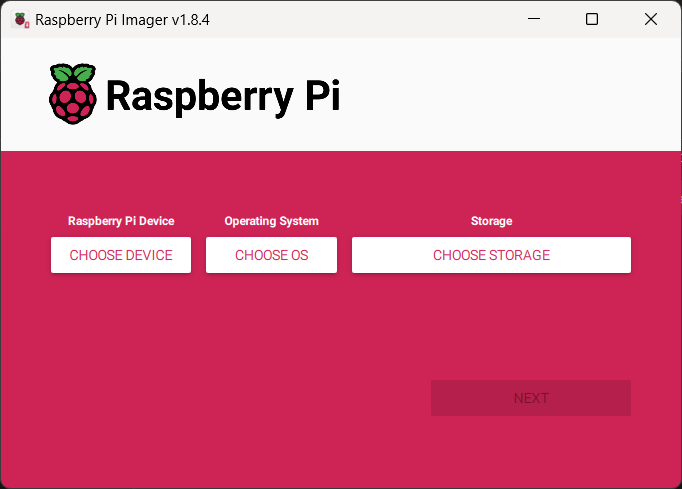

Click the `Choose Device` button and select `Raspberry Pi Zero 2 W`

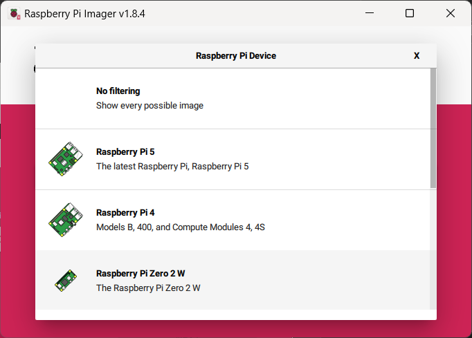
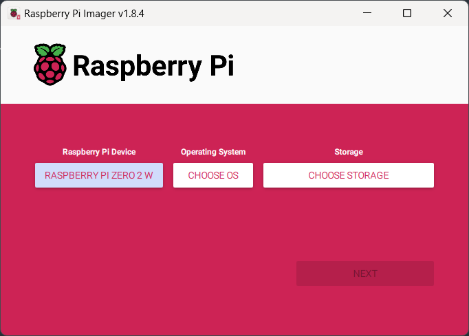

Click the `Choose OS` button and select `Raspberry Pi OS (other)`

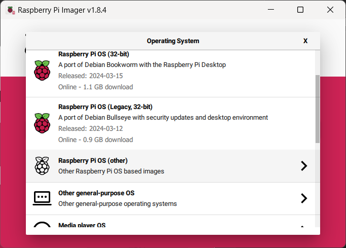

Then select `Raspberry Pi OS Lite (64-bit)`

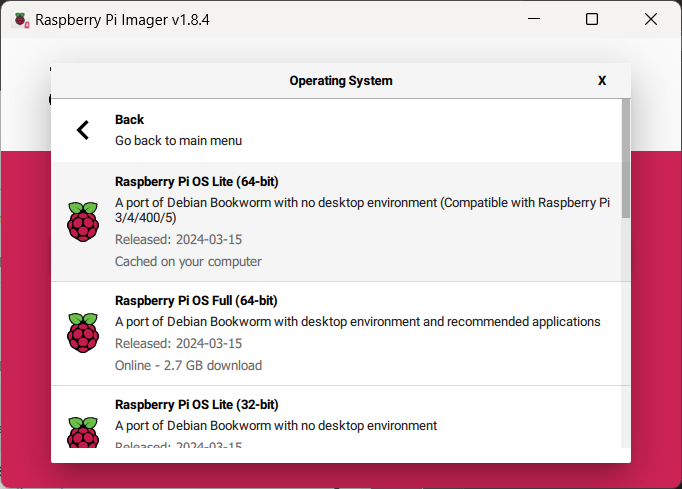
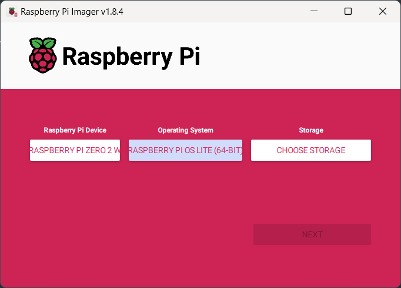

Click the `Choose Storage` button and select the Storage device that matches your inserted SD card

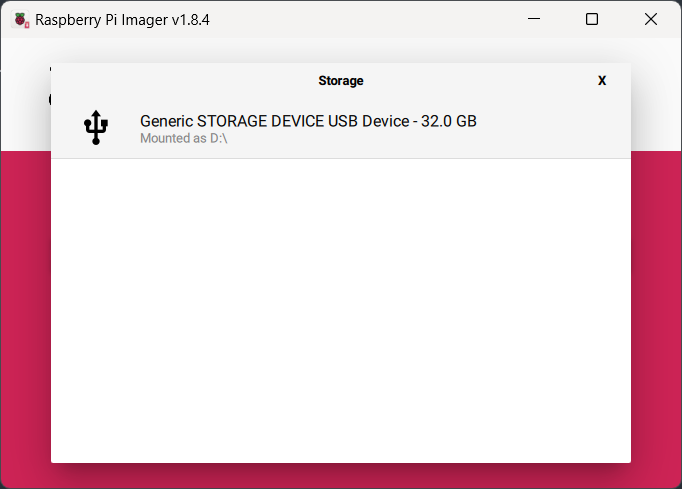
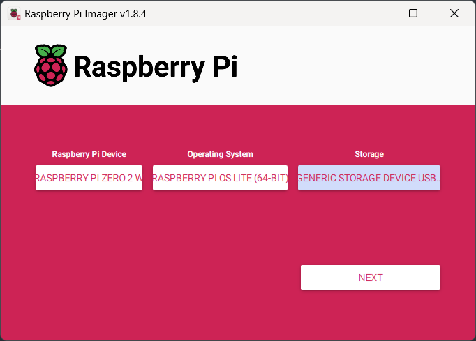

Now click the `Next` button and you will get a confirmation dialog.

It is *highly recommended* that you use `Edit Settings` at this point to set the following device features that are more challenging to set after the OS is already written.

- username
- password
- WiFi credentials
- Locale settings
- Enable SSH

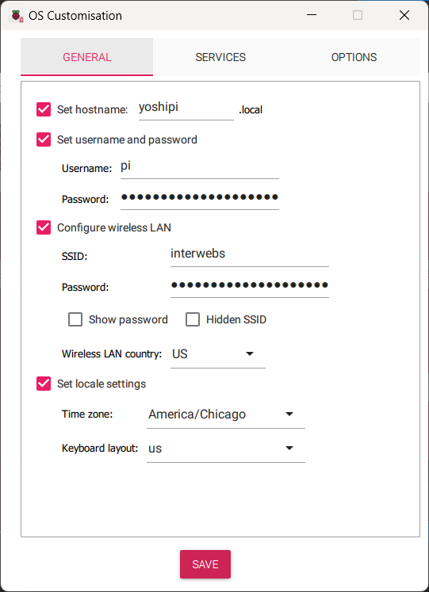
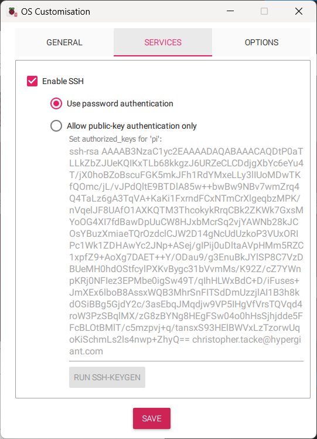

Once you `Save` your settings, it will return you to the confirmation dialog.

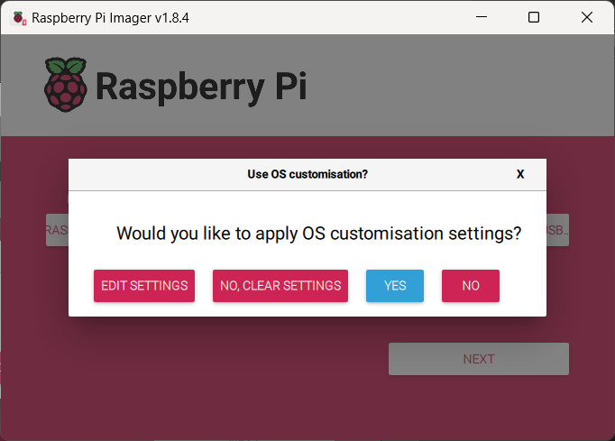

Click `Yes` and a anotehr confirmation dialog will appear.  If the drive is correct, click `Yes` to write the OS to the SD card.

You will see both write progress and verification progress.

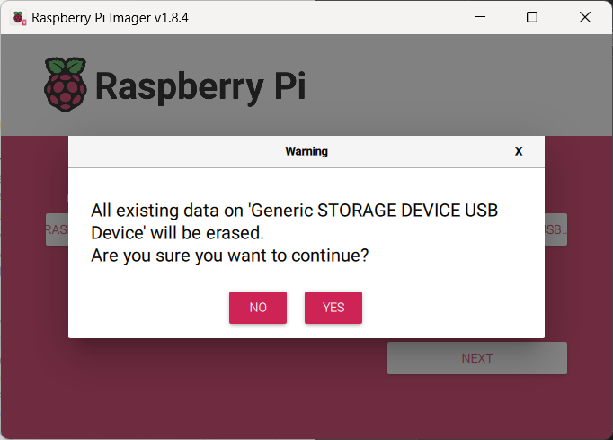
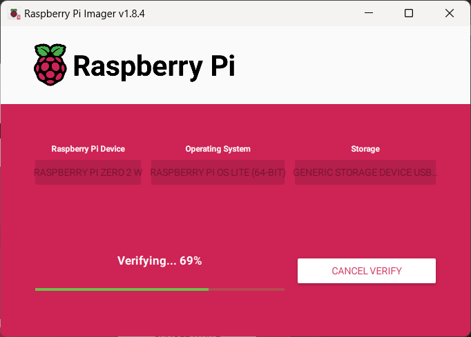

When it is complete you will get a final confirmation

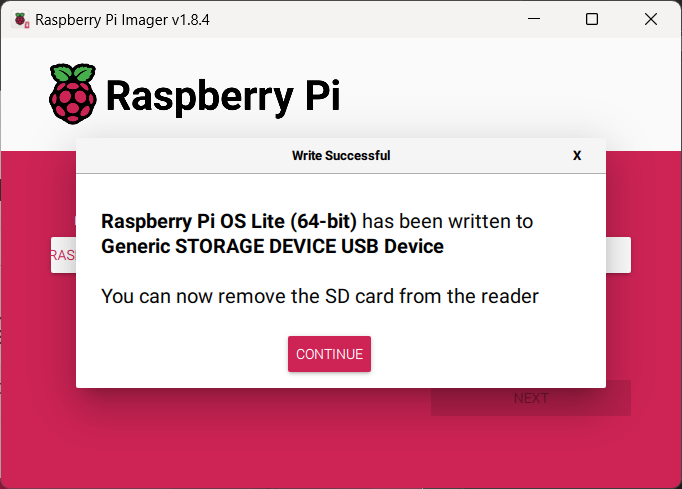

Click `Continue` and go ahead and close Pi Imager.

Your OS is now ready.  Insert the SD card into your aspberry Pi Zero 2 W.

