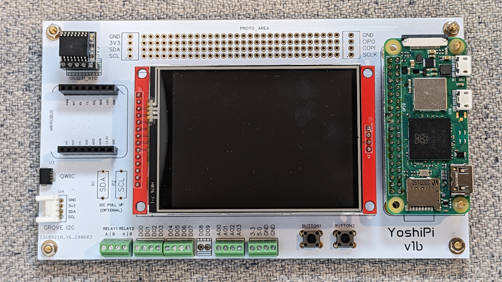

# Introducing YoshiPi: The Ultimate Raspberry Pi Zero 2 W Expansion Board for C# IoT Developers

The YoshiPi is coupling of a versatile carrier board for the Raspberry Pi Zero 2 W and the [Wilderness Labs'](https://wildernesslabs.co) Meadow software stack.  It's perfect for C# developers delving into IoT, robotics, and embedded systems. 

It features 4 10-bit analog inputs, 2 dry contact relays, 10 GPIO pins, a touchscreen display, and connectors for Mikrobus, Grove I2C, and Qwiic I2C, all powered by the robust quad-core 64-bit ARM Cortex-A53 CPU of the Raspberry Pi Zero 2 W. With integrated Wi-Fi and Bluetooth, YoshiPi ensures seamless connectivity and performance. 

### Key Features:

- **Raspberry Pi Zero 2 W Compatibility:** Seamlessly integrate YoshiPi with your Raspberry Pi Zero 2 W, providing a robust platform for your C# IoT applications.
- **4 10-bit Analog Inputs:** Precisely capture analog signals with four 10-bit analog inputs, perfect for interfacing with sensors and other analog devices.
- **2 Dry Contact Relays:** Control external devices effortlessly using the two built-in dry contact relays, ensuring reliable switching for your IoT projects.
- **10 GPIO Pins:** Expand your project capabilities with 10 General Purpose Input/Output (GPIO) pins, offering diverse connectivity options.
- **Display with Touchscreen:** Enjoy intuitive control and real-time feedback with an integrated display featuring a responsive touchscreen interface.
- **Mikrobus Connector:** Enhance your projects with MikroElektronika click boards through the Mikrobus connector, providing seamless expandability.
- **Grove I2C Connector:** Simplify the addition of sensors and actuators using the Grove I2C connector, designed for quick and easy integration.
- **Qwiic I2C Connector:** Connect effortlessly to Qwiic-enabled devices with the Qwiic I2C connector, supporting robust and flexible I2C communication.
- **Proto-board Area:** Prototype and test custom circuits with ease using the integrated proto-board area, perfect for quick iterations and development.

## Hardware

Current Hardware Version: **v1b**

- [Schematic](Hardware/v1b/Schematic_YoshiPi_v1b.pdf)
- [Validation Checklist](Hardware/v1b/v1b-validation.md)
- [Known Issues](Hardware/v1b/v1b-known-issues.md)
- [Checklist for vNext](Hardware/v1c/v1c-checklist.md)

## Getting Started

### [Write the OS to an SD Card](Docs/create-an-sd-card.md)
### [Boot your Pi](Docs/booting-your-pi.md)
### [Install Prerequsites](Docs/installing-prereqs.md)
