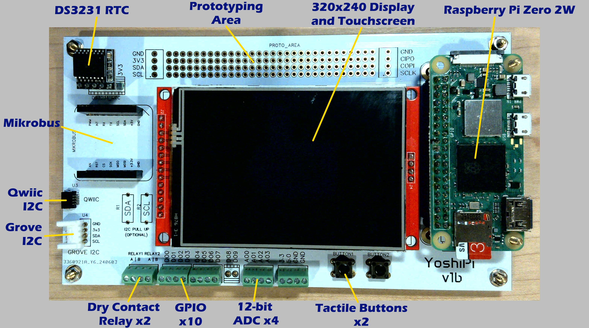

# Introducing YoshiPi: The Ultimate Raspberry Pi Zero 2 W Expansion Board for C# IoT Developers

Unleash the power of your Raspberry Pi Zero 2 W with YoshiPi, the advanced expansion board tailored for C# IoT developers. YoshiPi offers an array of features that simplify development and enhance performance, enabling you to build sophisticated, connected solutions with ease.

### Key Features:

- **Raspberry Pi Zero 2 W Compatibility:** Seamlessly integrate YoshiPi with your Raspberry Pi Zero 2 W, providing a robust platform for your C# IoT applications.
- **4 10-bit Analog Inputs:** Precisely capture analog signals with four 10-bit analog inputs, perfect for interfacing with sensors and other analog devices.
- **2 Dry Contact Relays:** Control external devices effortlessly using the two built-in dry contact relays, ensuring reliable switching for your IoT projects.
- **10 GPIO Pins:** Expand your project capabilities with 10 General Purpose Input/Output (GPIO) pins, offering diverse connectivity options.
- **Display with Touchscreen:** Enjoy intuitive control and real-time feedback with an integrated display featuring a responsive touchscreen interface.
- **Mikrobus Connector:** Enhance your projects with MikroElektronika click boards through the Mikrobus connector, providing seamless expandability.
- **Grove I2C Connector:** Simplify the addition of sensors and actuators using the Grove I2C connector, designed for quick and easy integration.
- **Qwiic I2C Connector:** Connect effortlessly to Qwiic-enabled devices with the Qwiic I2C connector, supporting robust and flexible I2C communication.
- **Proto-board Area:** Prototype and test custom circuits with ease using the integrated proto-board area, perfect for quick iterations and development.

### Why Choose YoshiPi?

- **Designed for C# IoT Development:** Optimize your development workflow with YoshiPi, a board that caters specifically to the needs of C# IoT developers.
- **Versatile Connectivity:** Leverage a wide range of input and output options to build comprehensive IoT solutions, from smart home devices to industrial automation.
- **User-Friendly Interface:** The integrated touchscreen display and intuitive connectors simplify your development process, allowing you to focus on coding and innovation.
- **Seamless Expandability:** The Mikrobus, Grove, and Qwiic connectors enable easy expansion and enhancement of your projects without complex wiring or soldering.
- **Reliable Performance:** Built with high-quality components to ensure dependable operation and longevity, giving you peace of mind for your IoT deployments.

Elevate your Raspberry Pi Zero 2 W IoT projects with YoshiPi, the all-in-one expansion board designed to bring your C# applications to life with unmatched functionality and ease. Get YoshiPi today and start creating the future of connected technology!

## Hardware

Current Hardware Version: **v1a**

- [Schematic](Hardware/v1b/Schematic_YoshiPi_v1b.pdf)
- [Validation Checklist](Docs/v1a-validation.md)
- [Known Issues](Docs/v1a-known-issues.md)
- [Checklist for vNext](Docs/v1b-checklist.md)

## Getting Started

### [Write the OS to an SD Card](Docs/create-an-sd-card.md)
### [Boot your Pi](Docs/booting-your-pi.md)
### [Install Prerequsites](Docs/installing-prereqs.md)
